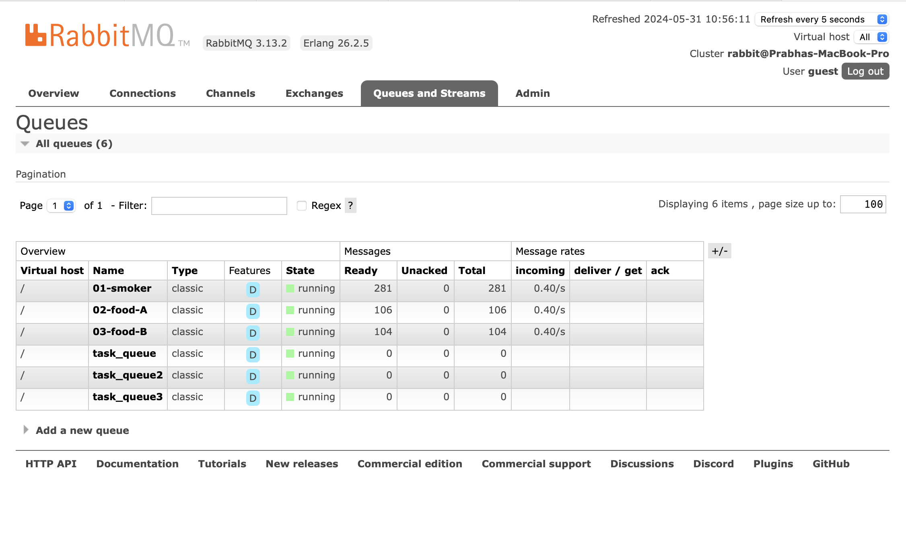
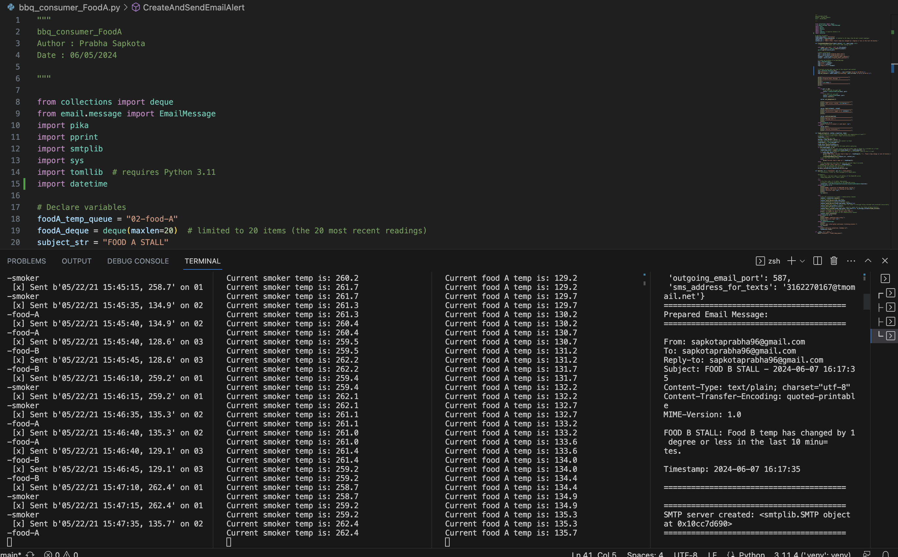

# Module 6: streaming-05-smart-smoker
Author: Prabha Sapkota
Date: 05/30/2024

## Objectives: 
 * We'll look at implementing analytics for a "smart smoker" (as in slow cooked food).
 * We'll understand the process, design our system, and implement the producer. 
 * We'll add the consumers, implementing analytics based on a rolling window of time, and raise an alert when interesting events are detected. 

## Requirements:
* RabbitMQ Server running
* Pika installed in .venv
* Use Module 4 projects as examples
* Configure.env.toml with appropriate email configuration settings
   * outgoing_email_host = "smtp.example.com"
   * outgoing_email_port = XXX
   * outgoing_email_address = "your_email@example.com"
   * outgoing_email_password = "your_password"

## Task 1: Create a place to work
* In GitHub, create a new repo for your project - name it * *
* Add a README.md during the creation process. (If not, you can always add it later.)
* Clone your repo down to your machine. 
* In VS Code,add a .gitignore (use one from an earlier module), start working on the README.md Create it if you didn't earlier.
* Add the csv data file to your repo. 
* Create a file for your bbq producer.

## Task 2: Design and Implement your producer
* Implement your bbq producer. 
* Use the logic, approach, and structure from Module 4, version 2 and version 3.
* These provide a current and solid foundation for streaming analytics - modifying them to serve your purpose IS part of the assignment.
* Do not start from scratch - do not search for code - do not use a notebook.
* Use comments in the code and repo to explain your work. 
* Document your project works - display screenshots of your console and maybe the RabbitMQ    console. 

## Task 3: Design and Implement Each Consumer
* Design and implement each bbq consumer. You could have one. You could have 3.  More detailed help provided in links below. 
* Use the logic, approach, and structure from prior modules (use the recommended versions).
 Modifying them to serve your purpose IS part of the assignment.
* Do not start from scratch - do not search for code - do not use a notebook.
* Use comments in the code and repo to explain your work. 
* Use docstring comments and add your name and date to your README and your code files. 
 

## Screenshots

## More Guidance
* To be guided through the producer design, read https://nwmissouri.instructure.com/courses/60464/pages/module-5-dot-1-guided-producer-design?wrap=1
* For a bit more guidance on the coding implementation, read Module Implementation https://nwmissouri.instructure.com/courses/60464/pages/module-5-dot-2-guided-producer-implementation?wrap=1
* To be guided through the consumer design, read Module https://nwmissouri.instructure.com/courses/60464/pages/module-6-dot-1-guided-consumer-design
* For guidance on consumer implementation, read Module https://nwmissouri.instructure.com/courses/60464/pages/module-6-dot-2-guided-consumer-implementation
* For guidance on implementing a consumer callback, read Module https://nwmissouri.instructure.com/courses/60464/pages/module-6-dot-3-implementing-a-callback-function?wrap=1 
* Use the discussion forum when you get stuck.
* Try to help without giving away code. 
* Use the discussion forum when you get stuck.
* Try to help without giving away code. 
    
